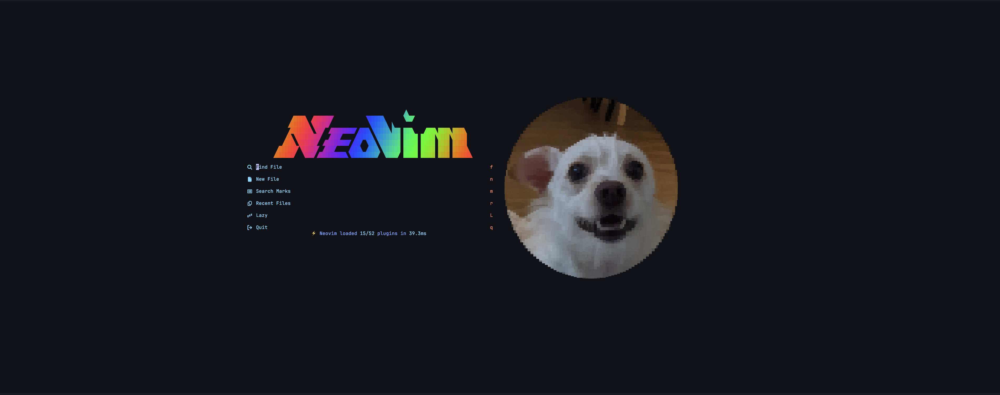
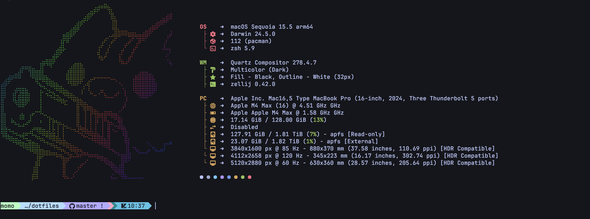
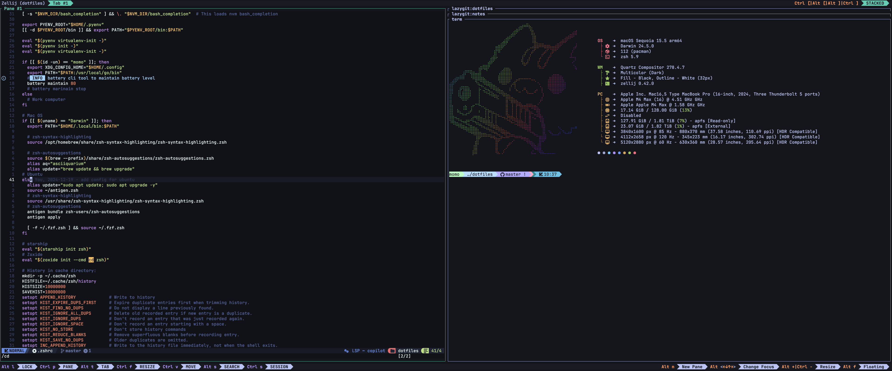

# 🏠 Dotfiles Collection

> _A carefully curated collection of configuration files for a modern, productive development environment_

[](https://www.apple.com/macos/)
[](https://ubuntu.com/)
[](LICENSE)

## ✨ What's Inside

This dotfiles repository transforms your terminal into a powerful, beautiful, and efficient development environment. All configurations are managed through **GNU Stow** for easy symlink management.





### 🛠️ Core Tools & Features

| Tool             | Purpose               | Benefits                                                |
| ---------------- | --------------------- | ------------------------------------------------------- |
| 🚀 **Neovim**    | Modern text editor    | Lightning-fast editing with LSP support                 |
| ⭐ **Starship**  | Cross-shell prompt    | Beautiful, informative prompt with git integration      |
| 🔍 **FZF**       | Fuzzy finder          | Blazing fast file/command searching                     |
| 📁 **Zoxide**    | Smart cd command      | Jump to directories with intelligent frequency ranking  |
| 🎨 **Eza**       | Modern ls replacement | Colorful, tree-view file listings                       |
| 🦇 **Bat**       | Cat with wings        | Syntax highlighting and git integration                 |
| 🏃 **Fastfetch** | System info           | Beautiful system information display with custom images |
| 🌈 **Lolcat**    | Rainbow text          | Add some fun to your terminal output                    |

### 🎯 Development Environment

- **Python**: Managed with `pyenv` and `pyenv-virtualenv`
- **Node.js**: Managed with `nvm`
- **Rust**: Full toolchain with `rustup`
- **Java**: Managed with `SDKMAN!` (macOS)
- **AI Tools**: `aider-chat`, `claude-cli`, and `ollama` integration

### 🎨 Theme & Aesthetics

- **Tokyo Night** theme across all applications
- Consistent color scheme for terminal, editor, and tools
- Custom Starship prompt with gradient colors
- Beautiful ASCII art and system info on startup

## 🚀 Quick Setup

### Prerequisites

- **macOS**: Xcode Command Line Tools
- **Ubuntu**: Build essentials and curl

### One-Command Installation

```bash
git clone https://github.com/yourusername/dotfiles.git ~/dotfiles
cd ~/dotfiles
./setup.sh
```

The setup script will:

1. 📦 Install all dependencies based on your OS
2. 🔗 Create symlinks using GNU Stow
3. ⚙️ Configure shell and tools
4. 🎉 Set up your development environment

### Manual Installation

If you prefer to install step by step:

```bash
# Install GNU Stow
# macOS
brew bundle
# Dump new file
brew bundle dump

# Install standalone package
brew install stow

# Ubuntu
sudo apt install stow

# Clone and setup
git clone https://github.com/yourusername/dotfiles.git ~/dotfiles
cd ~/dotfiles
stow .
```

## 📁 Structure

```
dotfiles/
├── bin/                 # 🔧 Custom binaries and scripts
│   ├── fastfetch        # Custom compiled fastfetch with image support
│   └── fastfetch-zellij # Wrapper script for zellij compatibility
├── .config/
│   ├── nvim/            # 🚀 Neovim configuration
│   ├── kitty/           # 🐱 Terminal emulator
│   ├── starship.toml    # ⭐ Shell prompt
│   ├── bat/             # 🦇 Syntax highlighter
│   ├── eza/             # 📁 File listing
│   ├── fastfetch/       # 🏃 System info with custom image
│   ├── lazygit/         # 🌿 Git TUI
│   ├── yazi/            # 📂 File manager
│   └── zellij/          # 🔲 Terminal multiplexer
├── .zshrc               # 🐚 Shell configuration
├── .gitconfig           # 📝 Git settings
└── setup.sh             # 🛠️ Installation script
```

## 🔧 Customization

### Shell Aliases & Functions

The `.zshrc` includes many useful aliases:

```bash
# System updates
update          # Update package manager (brew/apt)

# File operations
ll              # Detailed file listing with eza
la              # All files including hidden
tree            # Directory tree view

# Fastfetch shortcuts
ff              # Quick fastfetch with custom config and image
fastfetch       # Function that handles zellij compatibility

# Git shortcuts
gs              # git status
ga              # git add
gc              # git commit
gp              # git push
```

### Environment Variables

Key environment variables are configured:

- `EDITOR="nvim"` - Default editor
- `AIDER_EDITOR="nvim"` - AI coding assistant editor
- `MANPAGER="nvim +Man!"` - Use Neovim for man pages

## 🖼️ Custom Fastfetch Setup

This dotfiles includes a custom-compiled fastfetch binary with **ImageMagick7** and **chafa** support for displaying custom images as ASCII art in your terminal.

### Features

- **Custom Image Display**: Shows your custom image (`~/.config/nvim/assets/rosie.png`) instead of the default OS logo
- **Zellij Compatibility**: Special function to work around terminal multiplexer limitations
- **ASCII Art Conversion**: Uses chafa to convert images to beautiful terminal-compatible ASCII art

### Usage

```bash
# Quick fastfetch with your custom config
ff

# Standard fastfetch (with zellij compatibility built-in)
fastfetch --config "$HOME/dotfiles/.config/fastfetch/config.jsonc"

# Use wrapper script directly
~/dotfiles/bin/fastfetch-zellij --config "$HOME/dotfiles/.config/fastfetch/config.jsonc"
```

### Zellij Compatibility

Fastfetch normally disables image logos when running in terminal multiplexers like zellij. This setup includes:

1. **Shell Function**: Automatically handles zellij environment variables
2. **Wrapper Script**: `bin/fastfetch-zellij` for direct usage
3. **Custom Binary**: Compiled with full image support

### Configuration

Your fastfetch config (`~/.config/fastfetch/config.jsonc`) includes:

- Custom image path and chafa rendering
- Tokyo Night color scheme integration
- Optimized layout for your terminal setup

### Recompiling (if needed)

```bash
cd /path/to/fastfetch/source
mkdir build && cd build
cmake .. -DENABLE_IMAGEMAGICK7=ON -DENABLE_CHAFA=ON
make -j$(nproc)
cp fastfetch ~/dotfiles/bin/
```

## 🐛 Troubleshooting

### Common Issues

#### 🔗 Symlink Conflicts

```bash
# Remove existing symlinks
stow -D .

# Clean up conflicting files
rm ~/.zshrc ~/.gitconfig

# Recreate symlinks
stow .
```

#### 🐚 Shell Not Changing

```bash
# Make zsh default shell
chsh -s $(which zsh)

# Reload shell configuration
source ~/.zshrc
```

#### 📦 Missing Dependencies

```bash
# Re-run setup script
./setup.sh

# Or install specific tools manually
brew install nvim starship zoxide fzf eza bat  # macOS
sudo apt install neovim zsh git curl          # Ubuntu
```

#### 🚀 Neovim Issues

```bash
# Clear Neovim cache
rm -rf ~/.local/share/nvim
rm -rf ~/.cache/nvim

# Reinstall plugins
nvim +Lazy
```

#### 🔍 FZF Not Working

```bash
# Reinstall FZF
~/.fzf/install --all

# Or via package manager
brew reinstall fzf  # macOS
```

#### 🖼️ Fastfetch Image Not Showing

```bash
# Check if running in zellij (should show custom image)
ff

# Test outside terminal multiplexer
unset ZELLIJ ZELLIJ_PANE_ID ZELLIJ_SESSION_NAME && fastfetch --config "$HOME/dotfiles/.config/fastfetch/config.jsonc"

# Verify image file exists
ls -la ~/.config/nvim/assets/rosie.png

# Check fastfetch features
~/dotfiles/bin/fastfetch --list-features
# Should show: imagemagick7, chafa
```

### 🆘 Getting Help

1. Check the [troubleshooting section](#-troubleshooting)
2. Review tool-specific documentation in `.config/`
3. Open an issue with your system info and error message

## 🎯 Key Features

### 🚀 Productivity Boosters

- **Smart Navigation**: Jump to any directory with `z <partial-name>`
- **Fuzzy Everything**: Find files, commands, and history with `Ctrl+R`, `Ctrl+T`
- **Git Integration**: Visual git status in prompt, easy git commands
- **AI Assistance**: Integrated AI tools for coding help

### 🎨 Visual Enhancements

- **Consistent Theming**: Tokyo Night everywhere
- **Rich File Listings**: Icons, colors, and git status in file lists
- **Beautiful Prompt**: Multi-line prompt with git, time, and system info
- **Syntax Highlighting**: Code highlighting in terminal and editor

### ⚡ Performance

- **Fast Startup**: Optimized shell configuration
- **Lazy Loading**: Plugins and tools load only when needed
- **Smart Caching**: Reduced redundant operations

## 🤝 Contributing

Feel free to fork this repository and customize it for your needs! If you have improvements or fixes, pull requests are welcome.

## 📄 License

This project is licensed under the MIT License - see the [LICENSE](LICENSE) file for details.

---

<div align="center">

**Happy Coding!** 🎉

_Made with ❤️ and lots of ☕_

</div>
